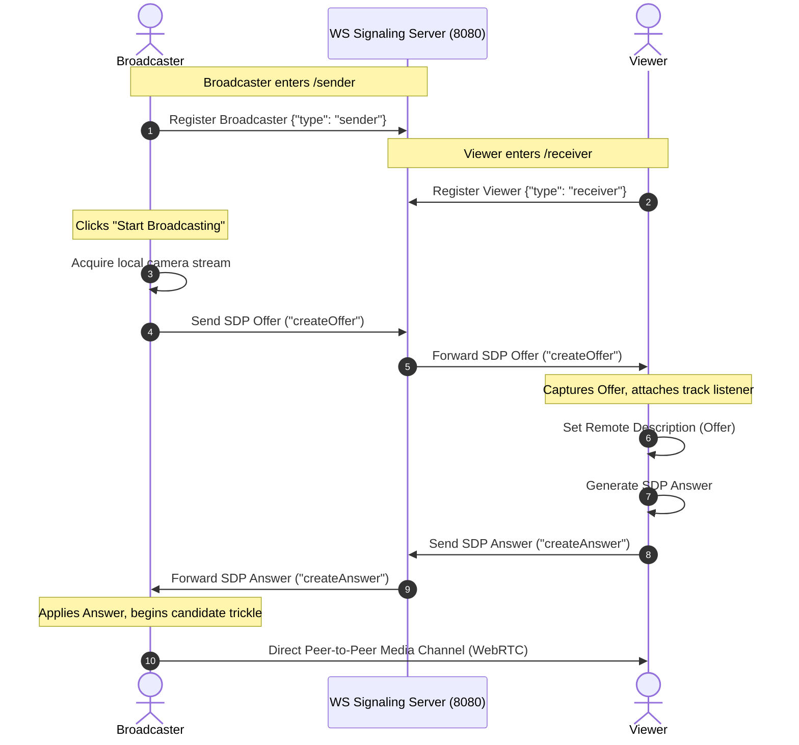

# 🌌 Nexus Stream: Peer-to-Peer WebRTC Media Broadcasting System

Nexus Stream is a high-performance, responsive, dark glassmorphic real-time media streaming application built on WebRTC and WebSocket signaling. It enables broadcasters to stream high-definition local camera feeds directly to viewers with sub-second, ultra-low latency (<30ms) through a decentralized peer-to-peer (P2P) network.

This repository implements the entire WebRTC offer-answer lifecycle, dynamic trickle ICE gathering, state-of-the-art glassmorphic HUD controls, and interactive telemetry diagnostic consoles.

---

## 📸 Key Features

* **🧭 Lobby Gateway Portal (`/`)**: A gorgeous dark dashboard to choose between Broadcaster Studio and Viewer Terminal modes.
* **📹 Broadcaster Studio (`/sender`)**: 
  * Live camera stream feed preview rendering.
  * Sleek floating **glass HUD controls** to toggle media tracks (mute/unmute camera) and terminate streams.
  * Real-time **Signaling Telemetry Log Console** visualizing handshake states step-by-step.
  * Active feed analytics (Protocol, Resolution, State, Encryption, Estimated Latency).
* **📺 Viewer Terminal (`/receiver`)**:
  * Glowing neon standby indicators when no active broadcast feed is detected.
  * Interactive playback toolbar supporting audio output muting and hardware-accelerated fullscreen view.
  * Real-time remote SDP Answer generation and automated track attachment.
* **⚙️ Robust Signaling Backend**: Secure local WebSocket server handling peer identification, candidate trickling, and session negotiation.

---

## 🔁 WebRTC Signal Pipeline & Flow

The P2P handshake routes control signals securely through the WebSocket server:



---

## 🛠️ Tech Stack

* **Frontend**: React (v19), TypeScript, React Router Dom, Lucide Icons, Vanilla CSS Glassmorphism
* **Backend**: Node.js, TypeScript, nodemon, `ws` (WebSockets), `ts-node`
* **Protocol**: WebRTC (RTCPeerConnection, SDP, DTLS, SRTP, ICE Trickle)

---

## 🚀 Quick Start & Installation

### Prerequisites
Make sure you have [Node.js](https://nodejs.org/) installed (v18+ recommended).

### 1. Run the Signaling Backend Server
```bash
# Navigate to the backend folder
cd backend

# Install dependencies (ws, typescript, ts-node, nodemon)
npm install

# Start the signaling server
npm start
```
The signaling server will start and listen on port **8080** (`ws://localhost:8080`).

### 2. Run the Frontend Dashboard
```bash
# Open a new terminal and navigate to the frontend folder
cd frontend

# Install dependencies (react, react-router, lucide-react)
npm install

# Start the Vite development server
npm run dev
```
Open **`http://localhost:5173/`** in your browser.

---

## 📖 How to Test the Stream
1. Open two browser windows:
   - Broadcaster Studio: `http://localhost:5173/sender`
   - Viewer Terminal: `http://localhost:5173/receiver`
2. Ensure both windows display a glowing green **`● READY`** status in the top right, indicating connection to the backend signaling tunnel.
3. On the **Broadcaster Studio**, click **Start Broadcasting** and grant camera permissions.
4. Watch the logs terminal in both windows instantly output the handshake process.
5. The media stream will start playing immediately on the **Viewer Terminal** with ultra-low latency!
